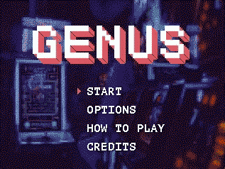
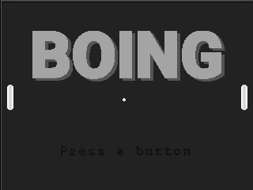
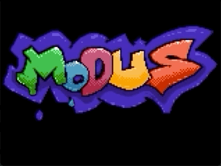
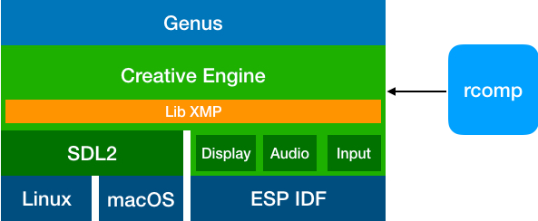

# Modus Create presents creative-engine 

This is a library of C++ classes for developing games for the ODROID-GO, the Raspberry Pi, and desktop Linux & MacOS.

The design criteria for this library/game engine are:

1) Portability. Games written using Creative Engine should easily port to other devices - it already runs on host and ODROID GO.
2) Development using [CLion](https://www.jetbrains.com/clion/) and SDL2 (CMake)
3) Run on device via Makefiles. (See [ESP32 IDF framework](https://docs.espressif.com/projects/esp-idf/en/latest/api-guides/build-system.html))
4) Support for 2D and 3D games
5) Extendable through class inheritance

## Features
1) Double-buffered LCD display driver, running at 30Hz.
2) Resource management (and resource compiler).
3) Audio driver using[LibXMP](http://xmp.sourceforge.net/).
3) Rich bitmap classes that support ROM and RAM pixel sources (resources).
4) Simple Sprites using sprite sheets.
5) Animated Sprites via animation interpreter, inherits from Simple Sprite.
6) State machines (processes) for player and enemy logic.
7) Develop on host using rich development tools, run on target with little or no effort.

# Games that use Creative Engine:

#### [Genus](https://github.com/moduscreateorg/genus)

#### [Boing](https://github.com/moduscreateorg/boing)

#### [Brickout](https://github.com/moduscreateorg/brickout)

## How Creative Engine works
The following visualization depicts the layers of the various libraries at play.

#### All platforms
[Creative Engine](https://github.com/ModusCreateOrg/creative-engine) This game engine. It implements LibXMP, SDL2, ESP-IDF (Audio, Video and Input drivers).\
[LibXMP](http://xmp.sourceforge.net/) is a fantastic cross-platform library for playing music using the [Xtended Module (XM)](https://en.wikipedia.org/wiki/XM_(file_format)) format and also has additional functionality to play sound effects.\

[Rcomp](https://github.com/ModusCreateOrg/creative-engine/blob/master/tools/rcomp.cpp) is a CLI tool that takes any binary resources and packages  (graphic, audio, etc.) them into a binary blob to be included in the game executable and is part of [Creative Engine](https://github.com/ModusCreateOrg/creative-engine).

#### macOS, Linux
[SDL2](https://www.libsdl.org/download-2) is a cross-platform low-level media layer framework. Creative Engine generates audio data with LibXMP and feeds it into the SDL2 audio runloo and does similar to present visuals in the application window as well as poll for keyboard input to allow for gameplay.

#### ODROID GO
[Espressif IoT development Framework (ESP IDF)](https://github.com/espressif/esp-idf) is a low level framework for accessing capabilities of the ESP32-WOVER SOC.

# Set up
See [the wiki](https://github.com/ModusCreateOrg/creative-engine/wiki) for instructions on getting things set up.

# Games made with creative-engine:
1) [Genus](https://github.com/ModusCreateOrg/genus)

## License
Creative Engine is licensed under [LGPL 2.1](./md/LICENSE) and contains a heavily modified version of [LibXMP](https://sourceforge.net/p/xmp/libxmp/ci/master/tree/README).

# Contributing
Interested in contributing to Genus? Please see our [developing](./md/DEVELOPING.md) and [contributions](./md/ONTRIBUTIONS.MD) guidelines. 
